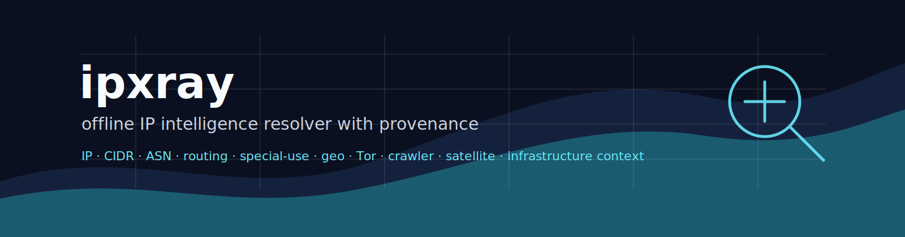

# ipxray

Local, offline IP intelligence resolution for IP addresses, CIDR ranges, and ASNs. `ipxray` syncs public release artifacts from the [`ipanalytics`](https://github.com/ipanalytics) ecosystem, builds local indexes, and returns explainable infrastructure context with provenance, freshness, and coarse confidence.

<p align="center">
  
</p>

<p align="center">
  <a href="./LICENSE"></a>
  
  
  
  
  
</p>

---

## Overview

`ipxray` is built for local enrichment pipelines, SOC tooling, network diagnostics, abuse triage, and data engineering jobs that need deterministic IP context without a runtime service dependency. After `sync`, lookups read only local artifacts and indexes.

The resolver works on public infrastructure evidence:

| Subject | Examples | Behavior |
| --- | --- | --- |
| IP | `8.8.8.8`, `2001:4860:4860::8888` | special-use check, longest-prefix match, ASN fallback |
| CIDR | `1.1.1.0/24`, `2001:db8::/32` | prefix overlap lookup |
| ASN | `AS15169`, `15169` | ASN-level organization and aggregate context |

The output is an evidence-backed report, not a binary allow/deny verdict. Every fact carries source names and confidence is deliberately coarse: `high`, `medium`, `low`, `conflict`, or `unknown`.

---

## Architecture

```text
GitHub releases
      |
      v
ipxray sync
      |
      +--> ~/.ipxray/cache/<source>/...
      +--> ~/.ipxray/sources.lock
      |
      v
source adapters
      |
      v
[]Evidence  --> local evidence index --> resolver --> []Fact --> explainer --> Report
```

The project uses a three-layer model:

| Layer | Purpose |
| --- | --- |
| Evidence | Raw source signal with provenance, source type, matched prefix, freshness, and `origin_family` |
| Fact | Normalized claim derived from evidence, with echo-aware confidence |
| Finding | Human-facing operational explanation with caveats |

`origin_family` prevents confidence inflation when multiple datasets derive from the same upstream source. Two RIR/BGP-derived records count as one independent corroboration.

---

## Features

- Offline IP/CIDR/ASN resolver after sync
- GitHub release sync with `sources.lock`
- SHA-256 verification when a release publishes `SHA256SUMS`
- IPv4 and IPv6 longest-prefix matching
- Special-use handling before enrichment
- Explicit `resolved`, `special_use`, and `no_data` statuses
- Evidence, fact, finding, source freshness, and provenance in every report
- Coarse, claim-typed confidence model
- JSON, YAML, Markdown, text, and JSONL bulk output
- Source filters for scoped lookups
- Conflict surfacing with `--explain-conflicts`
- Traffic-handling profiles for `web` and `firewall`
- Docker build target for static CLI deployment

---

## Data Sources

`ipxray` ships an embedded source registry. v0.3 wires the public ipanalytics source family for sync and line-oriented indexing.

| Source | Claim area | v0.3 handling |
| --- | --- | --- |
| ASNforge | Prefix-to-ASN, ASN organization | indexed |
| BogonForge | special-use and bogon policy | indexed |
| RouteSentinel | RPKI and routing context | indexed |
| IP-Knowledge-Layer | unified infrastructure context | indexed |
| Tor-Radar | Tor relay / exit infrastructure | indexed |
| CrawlerScope | crawler infrastructure | indexed |
| GeoForge | consensus GeoIP context | registry placeholder; current public release ships binaries, not dataset assets |
| GeoFeed-Harvester | operator geofeed context | indexed from CSV/CSV.GZ |
| Sat-geoip | satellite network context | indexed when JSONL/CSV artifact is present |
| BlackRoute | public infrastructure exposure context | registry placeholder; current public release ships binaries, not dataset assets |
| VPN Lab | ASN-level VPN aggregate context | indexed |

MMDB artifacts are downloaded, cached, and checksummed when a source publishes them. Source-specific MMDB decoding is intentionally isolated from the resolver and should be added per dataset schema.

---

## Quick Start

```bash
git clone https://github.com/ipanalytics/ipxray.git
cd ipxray

go run ./cmd/ipxray init
go run ./cmd/ipxray sync --source all
go run ./cmd/ipxray 8.8.8.8
```

JSON output:

```bash
go run ./cmd/ipxray 8.8.8.8 --json
```

Markdown report:

```bash
go run ./cmd/ipxray explain 185.220.101.23 --markdown --profile web
```

Bulk enrichment:

```bash
cat examples/google-dns.txt | go run ./cmd/ipxray bulk --jsonl > enriched.jsonl
```

---

## Installation

### From Source

```bash
go install github.com/ipanalytics/ipxray/cmd/ipxray@latest
```

### Local Build

```bash
go build -o bin/ipxray ./cmd/ipxray
./bin/ipxray doctor
```

### Docker

```bash
docker build -t ipxray .
docker run --rm -e IPXRAY_HOME=/data -v "$PWD/.ipxray:/data" ipxray doctor
```

---

## Usage

```bash
# lifecycle
ipxray init
ipxray sync [--if-stale 24h] [--source <name>|all]
ipxray sources
ipxray freshness
ipxray doctor

# lookup
ipxray 8.8.8.8
ipxray ip 8.8.8.8 --json
ipxray cidr 1.1.1.0/24 --yaml
ipxray asn AS15169 --markdown

# scoped analysis
ipxray 8.8.8.8 --sources asnforge,routesentinel
ipxray 185.220.101.23 --profile web
ipxray 185.220.101.23 --explain-conflicts

# bulk
cat ips.txt | ipxray bulk --jsonl > reports.jsonl
```

### Interesting Lookups

These examples are useful after a full `ipxray sync --source all`. They exercise different evidence paths without requiring live DNS or online lookup.

| IP / ASN | Expected context | Useful command |
| --- | --- | --- |
| `8.8.8.8` | Google public infrastructure, ASN and RPKI context | `ipxray 8.8.8.8 --json` |
| `1.1.1.1` | Cloudflare public resolver / anycast infrastructure | `ipxray 1.1.1.1 --markdown` |
| `66.249.66.1` | Google crawler infrastructure from CrawlerScope | `ipxray 66.249.66.1 --profile web` |
| `204.76.203.203` | Tor relay context from Tor-Radar snapshot data | `ipxray 204.76.203.203 --profile web` |
| `192.168.1.1` | RFC1918 private-use address, enrichment stops | `ipxray 192.168.1.1` |
| `100.64.0.1` | Shared address space / CGNAT special-use context | `ipxray 100.64.0.1` |
| `AS15169` | Google ASN organization and aggregate context | `ipxray asn AS15169 --json` |

For VPN-oriented context, query ASNs instead of treating an individual IP as a user signal:

```bash
ipxray asn AS16276 --sources vpn_lab,asnforge --json
```

### Example: Special-Use Address

```text
ipxray 192.168.1.1

Subject      IP 192.168.1.1  (matched 192.168.0.0/16)
Status       SPECIAL_USE

Findings
  - Special-use address space - This is not public infrastructure. Do not geolocate, classify, or score it. (high)
```

### Example: JSON Report Shape

```json
{
  "subject": {
    "type": "ip",
    "value": "8.8.8.8",
    "matched_prefix": "8.8.8.0/24"
  },
  "status": "resolved",
  "facts": [],
  "findings": [],
  "source_freshness": {},
  "confidence": "medium",
  "sources": []
}
```


```json
{
  "subject": {
    "type": "ip",
    "value": "8.8.8.8",
    "matched_prefix": "8.8.8.0/24"
  },
  "status": "resolved",
  "facts": [
    {
      "key": "ip_context",
      "value": {
        "asn": "",
        "asn_name": "",
        "confidence": "0.97",
        "country": "",
        "layer": "hosting-cloud",
        "prefix": "8.8.8.0/24",
        "provider": "Google",
        "region": "",
        "service": "",
        "source_id": "gcp-goog",
        "source_type": "official_json",
        "source_url": "https://www.gstatic.com/ipranges/goog.json",
        "tags": "google|internet-platform",
        "updated_at": "2026-05-26T04:47:07Z"
      },
      "confidence": "medium",
      "based_on": ["ip_context"],
      "sources": ["IP-Knowledge-Layer"]
    },
    {
      "key": "origin_asn",
      "value": {
        "asn": "AS15169",
        "org": "Google LLC"
      },
      "confidence": "high",
      "based_on": ["asn_org"],
      "sources": ["ASNforge"]
    },
    {
      "key": "rpki_status",
      "value": {
        "asn": "AS15169",
        "status": "valid"
      },
      "confidence": "high",
      "based_on": ["rpki_status"],
      "sources": ["RouteSentinel"]
    }
  ],
  "findings": [
    {
      "title": "Infrastructure context",
      "meaning": "Public dataset signal \"ip_context\" is present.",
      "caveat": "Treat this as infrastructure context, not a verdict about a user.",
      "confidence": "medium",
      "sources": ["IP-Knowledge-Layer"]
    },
    {
      "title": "Origin ASN context",
      "meaning": "Routing evidence links this prefix or ASN to public network infrastructure.",
      "caveat": "ASN ownership describes infrastructure, not the person using traffic from it.",
      "confidence": "high",
      "sources": ["ASNforge"]
    },
    {
      "title": "Route authorization",
      "meaning": "RPKI evidence is available for this route: map[asn:AS15169 status:valid].",
      "caveat": "RPKI describes route authorization, not intent or user identity.",
      "confidence": "high",
      "sources": ["RouteSentinel"]
    }
  ],
  "source_freshness": {
    "ASNforge": "24m0s",
    "IP-Knowledge-Layer": "23m0s",
    "RouteSentinel": "23m0s"
  },
  "confidence": "high",
  "sources": [
    "ASNforge",
    "IP-Knowledge-Layer",
    "RouteSentinel"
  ]
}
```

---

## Outputs and Artifacts

Local state is stored under `~/.ipxray` by default. Set `IPXRAY_HOME` to use another path.

```text
~/.ipxray/
  config.yaml
  sources.yaml
  sources.lock
  cache/<source>/...
  indexes/evidence.json
  reports/
```

| Artifact | Description |
| --- | --- |
| `sources.lock` | synced release IDs, tags, artifact hashes, and update times |
| `cache/<source>/` | downloaded release assets |
| `indexes/evidence.json` | normalized evidence index used for offline lookups |

Lookups do not perform network calls. GitHub access is limited to `sync`.

---

## Data Model

The resolver carries provenance from raw evidence through final output.

<details>
<summary>Core JSON types</summary>

```go
type Evidence struct {
    SubjectType   SubjectType `json:"subject_type"`
    Subject       string      `json:"subject"`
    MatchedPrefix string      `json:"matched_prefix,omitempty"`
    Signal        string      `json:"signal"`
    Value         any         `json:"value"`
    Source        string      `json:"source"`
    SourceType    string      `json:"source_type"`
    OriginFamily  string      `json:"origin_family"`
    Severity      string      `json:"severity"`
    ObservedAt    time.Time   `json:"observed_at"`
    ExpiresAt     *time.Time  `json:"expires_at,omitempty"`
    Provenance    Provenance  `json:"provenance"`
}

type Fact struct {
    Key        string   `json:"key"`
    Value      any      `json:"value"`
    Confidence string   `json:"confidence"`
    BasedOn    []string `json:"based_on"`
    Sources    []string `json:"sources"`
}
```

</details>

---

## Operational Notes

- Run `ipxray sync --if-stale 24h` from cron or a scheduled job to keep local data current.
- Use `ipxray freshness` to inspect release tags and update times across sources.
- Use `--sources` when validating a single dataset or debugging source-specific behavior.
- Treat `no_data` as absence of synced evidence, not as a statement about address use.
- Profile hints describe traffic handling, not user identity or intent.
- For reproducible pipelines, persist `sources.lock` with the generated report artifacts.

---

## Project Scope

`ipxray` is a local resolver and evidence engine. It does not run a daemon in the core path and it does not resolve domains in offline mode. Domain support belongs in a future opt-in online mode because DNS is live, non-deterministic input.

Current v0.3 scope:

- IP, CIDR, ASN subjects
- local sync/cache/index workflow
- source registry for ipanalytics release artifacts
- text, JSON, YAML, Markdown, and JSONL output
- traffic-handling profiles
- source freshness inspection

---

## Use Cases

- Enrich IP addresses in batch data pipelines
- Add infrastructure context to SIEM or SOAR workflows
- Inspect routing and special-use behavior during incident response
- Explain ASN and prefix context in network operations
- Validate public crawler, Tor, geofeed, and satellite infrastructure signals
- Build reproducible offline reports for investigations and audits

---

## Limitations

- MMDB assets are cached and verified; per-source MMDB decoding is not yet implemented.
- Confidence is intentionally coarse and claim-specific.
- Source quality depends on upstream release cadence and schema stability.
- Geolocation describes infrastructure and routing context, not a person.

---

## Repository Layout

```text
ipxray/
  cmd/ipxray/          CLI entrypoint
  internal/config/     source registry and local layout
  internal/fetcher/    GitHub release sync, cache, checksums
  internal/adapters/   source-specific artifact parsers
  internal/index/      local evidence store and lookup helpers
  internal/resolver/   IP/CIDR/ASN resolution flow
  internal/confidence/ claim-typed confidence model
  internal/explain/    fact-to-finding explanations
  internal/policy/     traffic-handling profile hints
  internal/output/     text, JSON, YAML, Markdown output
  testdata/            compact adapter and resolver fixtures
  examples/            sample inputs
  site/                README assets
```

---

## Development

```bash
go test ./...
go run ./cmd/ipxray doctor
```

The codebase is dependency-light by design. Adapters are the only package that knows source-specific artifact structure; resolver and confidence logic operate on normalized evidence.

### Release Builds

Compiled releases are built by GitHub Actions from `.github/workflows/release.yml`.

Tag-based release:

```bash
git tag v0.3.0
git push origin v0.3.0
```

The workflow builds Linux, macOS, and Windows binaries for `amd64` and `arm64`, publishes a GitHub Release, and attaches `checksums.txt`.

Manual release runs are also available from the GitHub Actions UI via `workflow_dispatch`.

---

## License

`ipxray` is released under the [MIT License](./LICENSE).

---

## Disclaimer

`ipxray` reports public network infrastructure evidence. It should be used as operational context and reviewed according to the policies of the environment where it is deployed.
